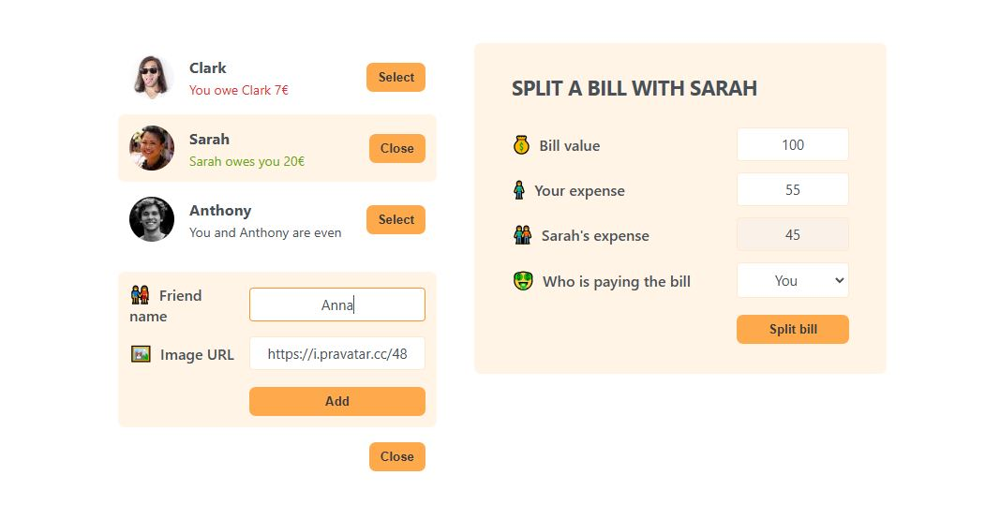

# Eat-n-split 🍽️

Welcome to **Eat-n-split** – a React application designed to help you split bills with friends. This app provides an intuitive interface to manage expenses between friends, allowing users to track debts and settle amounts easily.

## Features

- Display friends with names, profile pictures, and balance statuses
- Add new friends dynamically with custom names and with profile pictures fetched from Pravatar
- Select friends to split bills with and manage balances
- Bill-splitting form that calculates expenses for both user and selected friend
- Responsive design for a smooth experience on all device sizes

## Demo

Check out the live version:

[https://eat-n-split-zeta-ruby.vercel.app/](https://eat-n-split-zeta-ruby.vercel.app/)

## Technologies Used

- **React** – for building the UI components and managing state
- **CSS** – for styling and responsive design

## Installation

To run this project locally, follow these steps:

1. Clone this repository: `git clone https://github.com/MilotaiEduard/Eat-n-split.git`

2. Navigate to the project folder: `cd Eat-n-split`

3. Install dependencies: `npm install`

4. Start the development server: `npm start`

The application will open on `http://localhost:3000`.

## Project Structure

- `/src`: Contains the main components and logic for managing friends and splitting bills.
- `/public`: Stores static assets like images.
